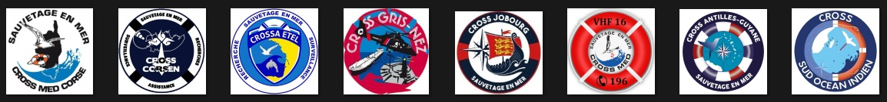

# ⛵ Projet

Celui-ci est une mise en pratique des connaissances acquises lors du <a href="https://www.jedha.co/formations/data-analysis-fullstack" target="_blank">bootcamp Jedha - Data Analysis Full Stack</a>  

N'hésitez pas à consulter le powerpoint qui reprend sa [présentation](00_Presentation/Les_opérations_de_sauvetage_en_mer.pptx?raw=true) 🙂

# 🛟 Cross

### "Analyser, Prévoir, Agir"

La présente étude concerne les Centres Régionaux Opérationnels de Surveillance et de Sauvetage (C.R.O.S.S.).  
Son objectif principal est d'optimiser leur efficacité opérationnelle en utilisant une analyse approfondie des données recueillies.  

En réponse à un nombre grandissant d'interventions sur ces dernières années, et afin d'aider les CROSS dans la réussite de leur mission, l'idée est ici de fournir aux Centres un moyen leur permettant de monitorer leur activité.  

Cela se traduit notamment par la mise en place d'un tableau de bord rassemblant des indicateurs clés qui permettent d'identifier des tendances, et de mettre en lumière des patterns utiles aux divers décideurs et/ou opérateurs.  

Et, en complément, par la proposition d'un outil de machine learning.  
Alimenté par les statistiques collectées, son but est d'évaluer au mieux la criticité d'une situation à partir une liste de critères définis.  
Se positionnant comme une aide à la décision, il trouve sa place notamment en terme de priorisation dans les interventions.  

# 🗂 Arborescence

 
**DOSSIER** | **CONTENU** | **FORMAT** 
:---|:--- |:---
 00_Presentation | Présentation | .pptx 
 01_Data_input | Datasets utilisés pour le projet | .csv
 02_Data_output | Dataset consolidé | .csv
 03_Python | Data Processing |.ipynb
 04_Powerbi | Dashboard et Analyse | .pbix
 05_Streamlit | Modèle de machine learning |.py
 99_Pictures | Bibliothèque de photos utilisées | .jpg

 

# ℹ️ Sources

L'analyse proposée repose sur un dataset global et consolidé.  
Cinq jeux de données ont été nécessaires à son élaboration.  
Ces derniers rassemblent des statistiques sur les interventions d’assistance et de sauvetage coordonnées par les CROSS.

Vous les trouverez sur :
- https://www.data.gouv.fr/en/datasets/operations-coordonnees-par-les-cross
- https://carte.snosan.fr/

# 🔎 Dataset

**NOM** | **SIGNIFICATION** 
:---|:---
 operation_id | Le numéro unique de l'opération. 
 cross | CROSS en charge de la coordination de l'opération 
 type_operation | Le type d'opération coordonné par le CROSS : SAR (search and rescue) : vie humaine en danger - MAS (maritime assistance service) : assistance aux navires - SUR : sûreté des navires - POL : pollutions - DIV : autres cas. 
 categorie_evenement | Catégorie de l'événement ayant donné lieu à l'opération 
 evenement | Évenement qui a donné lieu à l'opération 
 date_heure_reception_alerte | Date et heure de réception de l'alerte en UTC au format ISO8601 
 date_heure_fin_operation | Date et heure de fin de l'opération en UTC au format ISO8601 
 duree_operation_minutes | Durée de l'opération 
 categorie_qui_alerte | Catégorie du lanceur d'alerte 
 qui_alerte | Qui a donné l'alerte 
 moyen_alerte | Comment l'alerte a-t-elle été donnée 
 zone_responsabilite | Où se situe l'intervention 
 departement | Département où se déroule l'opération 
 latitude | Latitude de l'opération au format EPSG:4326 WGS84 
 longitude | Longitude de l'opération au format EPSG:4326 WGS84 
 distance_cote_milles_nautiques_cat | Catégorie de la distance 
 distance_cote_milles_nautiques | La distance entre la plus proche côte ou frontière terrestre en territoire français en milles nautiques. Cette distance peut être égale à 0 si l'opération se déroule très près des côtes ou à l'intérieur des terres en cas de fausse alerte. La distance peut être très élevée lors d'un déclenchement d'une balise par erreur ou en cas de coordination d'une opération impliquant un flotteur français en eaux internationales. 
 vent_direction_categorie | Nom de la direction du vent. La direction nord-est est par exemple comprise entre 22,5 degrés et 67,5 degrés. 
 vent_force | Force du vent selon l'échelle de Beaufort 
 mer_force | État de la mer selon l'échelle de Douglas 
 maree_categorie | Le nom de la catégorie de la marée pour l'opération. 
 maree_coefficient | Le coefficient moyen de marée de la journée de l'opération. Les marées sont renseignées pour les opérations coordonnées par les CROSS en Atlantique et Manche, lorsque l'opération est géolocalisée et que celle-ci se trouve à moins de 20 kilomètres de la plus proche côte. 
 date | La date de l'opération. La date de référence est la date de réception de l'alerte au fuseau horaire du CROSS coordinateur. 
 saison | Indique la haute (mai, juin, juillet, août, septembre) et la basse saison.  
 jour_semaine | Le jour de la semaine de l'opération en français. La date de référence est la date de réception de l'alerte au fuseau horaire du CROSS coordinateur. 
 phase_journee | Indique à quel moment de la journée l'opération se déroule. La date de référence est la date de réception de l'alerte en UTC qui tient compte de l'heure locale du CROSS coordonnant l'opérateur. Matinée : du lever du soleil jusqu'à 11:59 - Déjeuner : entre 12:00 et 13:59 - Après-midi : de 14:00 jusqu'au coucher du soleil - Nuit : entre le coucher du soleil et le lever du soleil. 
 jour_ferie | Indique si l'opération se déroule pendant un jour férié. La date de référence est la date de réception de l'alerte au fuseau horaire du CROSS coordinateur. 
 vacances_scolaires | Indique si l'opération se déroule pendant des vacances scolaires en zone A, B ou C. La date de référence est la date de réception de l'alerte au fuseau horaire du CROSS coordinateur. Quand le calendrier des vacances scolaires n'est pas connu, la donnée n'est pas renseignée. 
 nombre_moyens_engages_nautiques | Nombre de moyens nautiques déployés. 
 nombre_moyens_engages_aeriens | Nombre de moyens aériens déployés. 
 nombre_moyens_engages_terrestres | Nombre de moyens terrestres déployés. 
 duree_engagement_moyens_nautiques_minutes | Durée d'engagement des moyens nautiques en minutes. 
 duree_engagement_moyens_aeriens_minutes | Durée d'engagement des moyens aeriens en minutes. 
 duree_engagement_moyens_terrestres_minutes | Durée d'engagement des moyens terrestres en minutes. 
 categorie_flotteur | Grande catégorie à laquelle appartient le flotteur. 
 sous_categorie_flotteur | Indique le type précis du flotteur. 
 resultat_flotteur | État du flotteur à la fin de l'intervention. 
 bilan_humain | Description du bilan humain. 
 nombre_personnes_impliquées | Le nombre total de personnes impliquées lors de l'opération. 
 nombre_personnes_assistees | Le nombre total de personnes assistées lors de l'opération. 
 nombre_personnes_blessees_secourues_retrouvees | Le nombre total de personnes blessées, secourues et retrouvées lors de l'opération. 
 nombre_personnes_tous_deces_ou_disparues | Le nombre total de personnes décédées (qu'importe la cause) et le nombre de personnes disparues lors de l'opération. 
 nombre_flotteurs_plaisance_impliques | Le nombre de flotteurs de plaisance impliqués dans l'opération. 
 nombre_flotteurs_plaisance_a_moteur_impliques | Le nombre de flotteurs de plaisance à moteur impliqués dans l'opération. 
 nombre_flotteurs_plaisance_a_moteur_moins_8m_impliques | Le nombre de flotteurs de plaisance à moteur de moins de 8 mètres dans l'opération. 
 nombre_flotteurs_plaisance_a_moteur_plus_8m_impliques | Le nombre de flotteurs de plaisance à moteur de plus de 8 mètres impliqués dans l'opération. 
 flotteurs_plaisance_autre | Le nombre de flotteurs de plaisance autre. 
 nombre_flotteurs_plaisance_a_voile_impliques | Le nombre de flotteurs de plaisance à voile impliqués dans l'opération. 
 nombre_flotteurs_plaisance_voile_legere_impliques | Le nombre de flotteurs de plaisance à voile légère impliqués dans l'opération. 
 nombre_flotteurs_commerce_impliques | Le nombre de flotteurs de commerce impliqués dans l'opération. 
 nombre_flotteurs_peche_impliques | Le nombre de flotteurs de pêche impliqués dans l'opération. 
 nombre_flotteurs_loisirs_nautiques_impliques | Le nombre de flotteurs de loisirs nautiques impliqués dans l'opération. 
 nombre_flotteurs_autre_loisir_nautique_impliques | Le nombre de flotteurs de loisir nautique non déterminé impliqués dans l'opération. 
 nombre_flotteurs_canoe_kayak_aviron_impliques | Le nombre de canoë / kayak / aviron impliqués dans l'opération. 
 nombre_flotteurs_engin_de_plage_impliques | Le nombre d'engins de plage impliqués dans l'opération. 
 nombre_flotteurs_planche_a_voile_impliques | Le nombre de planches à voile impliquées dans l'opération. 
 nombre_flotteurs_surf_impliques | Le nombre de surfs impliqués dans l'opération. 
 nombre_flotteurs_kitesurf_impliques | Le nombre de kitesurfs impliqués dans l'opération. 
 nombre_flotteurs_ski_nautique_impliques | Le nombre de skis nautiques impliqués dans l'opération. 
 nombre_aeronefs_impliques | Le nombre d'aéronefs impliqués dans l'opération. 
 nombre_flotteurs_autre_impliques | Le nombre de flotteurs non catégorisés impliqués dans l'opération. 
 nombre_flotteurs_annexe_impliques | Le nombre d'annexes impliquées dans l'opération. 
 nombre_flotteurs_vehicule_nautique_a_moteur_impliques | Le nombre de véhicules nautique à moteur (jetski, scooter des mer, moto des mers etc.) impliqués dans l'opération. 
 flotteurs_vehicule_nautique | Le nombre de véhicules nautiques impliqués dans l'opération. 
 sans_flotteur | Le nombre de sans flotteur impliqués dans l'opération. 

